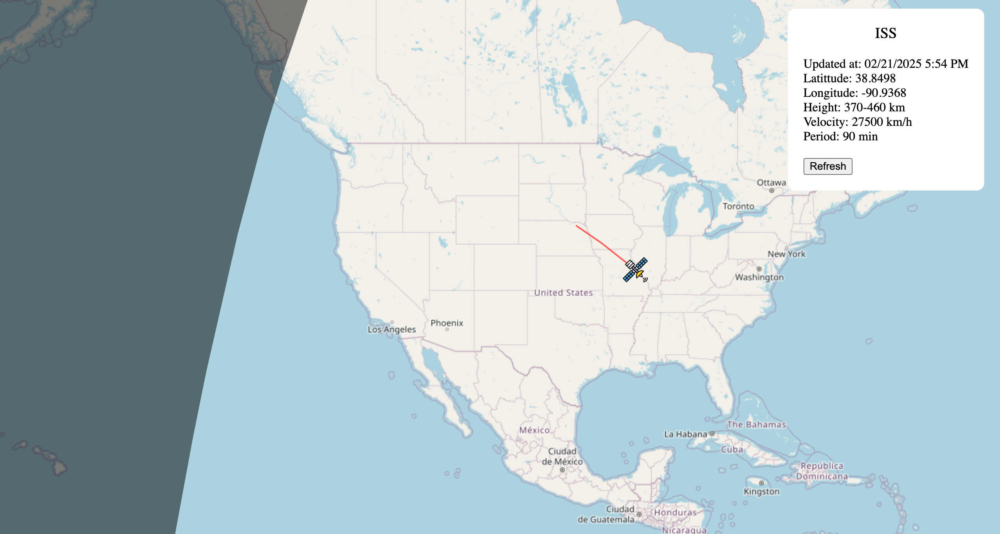

# satellite-tracker

Satellite tracker with Leaflet.js

> **Note:** At the moment only ISS satellite is tracked.

## Screenshot



## Features

- Real-time ISS position tracking
- Display of current coordinates, altitude, velocity, and period
- Interactive map with satellite path visualization
- Auto-refresh functionality

## Start project

### Backend

```
cd backend
npm install
npm run start
```

### Frontend

```
cd frontend
npm install
npm run dev
```
